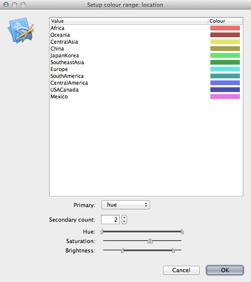
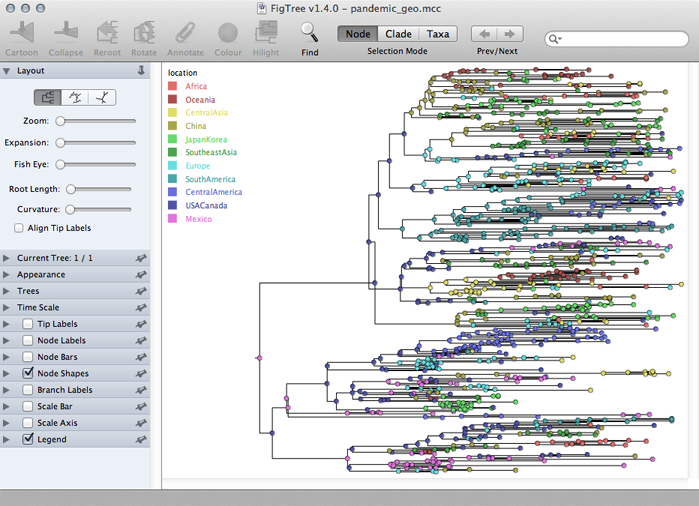
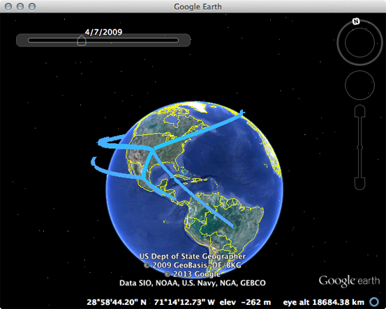

## Examine the phylogeographic output

**Open `pandemic_geo.log` in Tracer and increase 'Burn-in' to `10000000` (10 million).**

Here, we first confirm that the MCMC chain has converged and appears to be behaving properly.
The overall rate that one geographic location transitions to another location is measured by 'location.clock.rate'.

                                      | Lower | Mean | Upper
---                                   | ---   | ---  | ----
Geographic transition rate (per year) | 3.86  | 5.45  | 6.91

Let's now take a look at the geo-encoded phylogeny.
As before, we need to prepare a single MCC tree from the trees file.

**Open TreeAnnotator, set 'Burnin' to `400`, set 'Input file' to `pandemic_geo.trees` and 'Output file' to `pandemic_geo.mcc`.**

This will result in the file `pandemic_geo.mcc`, which I've included in the `output/` directory for convenience.

**Open FigTree and load the `pandemic_geo.mcc` file.**

As before, we will begin by streamlining the tree a bit.

**Turn off 'Tip labels' and 'Order nodes' in 'decreasing' order.**

We will annotate nodes with their geographic locations based on color.

**Turn on 'Node Shapes', enter `8` as 'Max size' and 'Colour by' location.**

This results in nodes colored by their most likely location.

**Click on 'Setup: Colour' to get a list of location colors.**

Elements of this list can be dragged up and down to get a more logical grouping of colors and locations.



Including a legend will make this more clear.

**Turn on 'Legend' and choose 'location' for 'Attribute'.**

The resulting phylogenies shows early nodes in Mexico and the USA and from them spreading to the rest of the world.



Adjustments can be made in the 'Layout' list to better see transitions between locations.

In the phylogeographic reconstruction, each node in each MCMC sample is annotated with a geographic location.
The certainty of the geographic reconstruction can be assessed by looking the distribution of node states across the MCMC.
The file `pandemic_geo.root` gives the reconstruction of the root node across the MCMC.
Here, we see the following distribution:

               | Frequency
---            | ---
Africa         | 0%
CentralAmerica | 5%
CentralAsia    | 0%
China          | 3%
Europe         | 3%
JapanKorea     | 1%
Mexico         | 63%
USACanada      | 22%
Oceania        | 0%
SouthAmerica   | 2%
SoutheastAsia  | 1%

Thus, we're quite confident in a Mexican origin of pandemic, though the USA receives a small amount of weight as well.

In addition, the phylogeographic reconstruction can be visualized as a spread across the globe, in a map-centric fashion, rather than the previous tree-centric visualization.
To do this, we will run a small script on the MCC tree that will create a KML file that can be viewed in Google Earth.
This script is called `phylogeo.jar` as is located in the `scripts/` directory.
This analysis requires latitude and longitude coordinates for each location in a tab-delimited file.
I've included this as `data/locs.txt`.

To run the script, open a terminal window, navigate to the `output/` directory and run the following:

```
java -jar ../scripts/phylogeo.jar -coordinates ../data/locs.txt -annotation location -mrsd 2009.75 pandemic_geo.mcc pandemic_geo.kml
```

This specifies the `locs.txt` coordinates file, that the geographic character state is called `location`, that the most recent tip is at `2009.75` and that the MCC tree is the file `pandemic_geo.mcc`.
Running this script generates the file `pandemic_geo.kml`, which I've included in the `output/` directory.

**Open Google Earth and open the `pandemic_geo.kml` file.**

This will display well-supported transitions on the globe and includes their date of occurence.



The emergence in Mexico and spread from the USA to the rest of the world can be clearly seen.