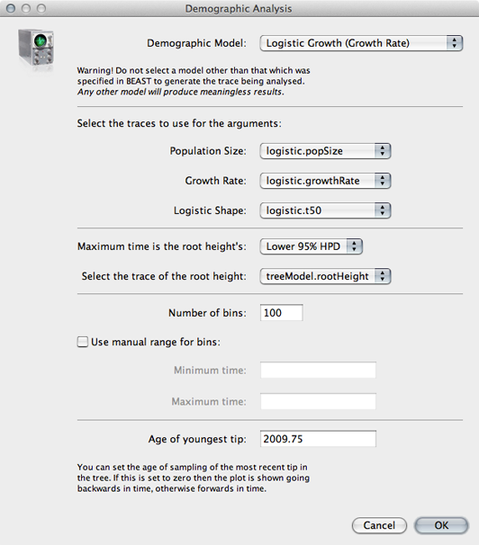
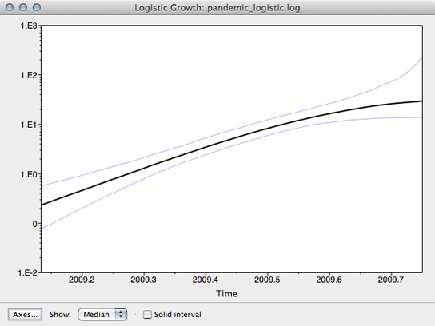

## Examine the logistic growth output

**Open `pandemic_logistic.log` in Tracer.**

Here, we see that each trace is behaving well, but that we need to set the burn-in higher than the default 5 million.

**Set 'Burn-in' to `10000000` (10 million).**

We get the following parameter estimates and 95% credible intervals for the logistic growth model:

                         | Lower | Mean  | Upper
---                      | ---   | ---   | ----
*K* (individual years)   | 9.49  | 48.38 | 140.49
*r* (per year)           | 6.65  | 10.64 | 14.47
*t*50 (years) | 0.02  | 0.17  | 0.28

Tracer can also be used to reconstruct population size through time according to the logistic growth model.

**Choose 'Demographic Reconstruction...' from the 'Analysis' menu.**

In the resulting dialog box, the demographic function chosen needs to be matched to the one actually used.

**Select 'Logistic Growth (Growth Rate)' from the 'Demographic Model' dropdown.**

The traces used for each of the three parameters are selected automatically.
However, overall timescale still needs to be set.

**Enter `2009.75` for 'Age of youngest tip'.**

**Click on 'OK' to perform the analysis.**

The resulting window shows the median estimate of population size through time, as well as its 95% credible interval.

Here, we see that population size has grown exponentially until around July or August when it's begun to saturate.
However, although the rate of initial exponential increase appears fairly well defined, there appears to be little certainty to the degree of recent saturation.

The equation log(2) / *r* can be used to calculate the doubling time in years of virus population.
The doubling time in days can be calculated by multiplying this by 365.

                     | Lower | Mean  | Upper
---                  | ---   | ---   | ----
Doubling time (days) | 17.48 | 23.78 | 38.04

Additionally, with knowledge of the serial interval between infections we can convert the growth rate in terms of years into an estimate of the fundamental reproductive number *R*0.
If we convert growth rate *r* into days, we get a mean estimate of 0.029 per day.
From basic [SIR dynamics](http://en.wikipedia.org/wiki/Compartmental_models_in_epidemiology) we expect the per-day rate of increase to be equal to the per-day contact rate *&beta;* minus the per-day recovery rate *&gamma;*.
Thus, we can solve for *&beta;* = *r* + *&gamma;*.
In this case, we can assume a 3 day duration of infection and thus *&gamma;* = 0.333 per day.
We estimate *&beta;* = 0.029 + 0.333 = 0.362 per day.
Then, by definition, *R*0 = *&beta;* / *&gamma;* = 0.362 / 0.333 = 1.09.

These estimates of viral population size are not in units of individuals, but instead in the same units as the phylogeny and thus years.
Population size in BEAST is the inverse of the rate of coalescence and is equal to effective population size *N*e multiplied by the generation time *&tau;* in years.
Early in the epidemic, when the fraction susceptible is close to 1, we expect generation time to depend only on contact rate, so that *&tau;* = 1 / (2 *&beta;*).
In this case, we estimate generation time early in the epidemic as *&tau;* = 1 / (2 * 0.362) = 1.38 days or 0.0038 years.
Thus, we can divide estimates of population size from BEAST by 0.0038 years to get an estimate of the number of individuals.
At the beginning of July, the logistic model estimates *N*e *&tau;* = 14.47 and thus predicts *N*e = 3809 infected individuals.
At the same time, the skyline model estimates a similar number of individuals.

Differences between census population size *N* and effective population size *N*e can be quite large, and can be generally explained by a large variance in the reproductive success of individual infections.
If the progeny of some infections are much more successful than the progeny of other infections in terms of eventual genetic legacy, there will be a large difference between *N* and *N*e.
This variance could arise from a variety of sources, including super-spreading, spatial effects and natural selection.

### Next section

* [Prepare a phylogeographic analysis](prepare-a-phylogeographic-analysis.md)