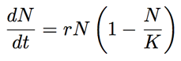
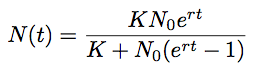
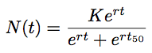
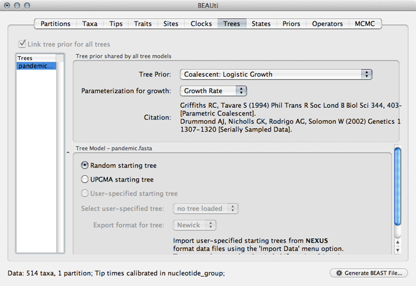
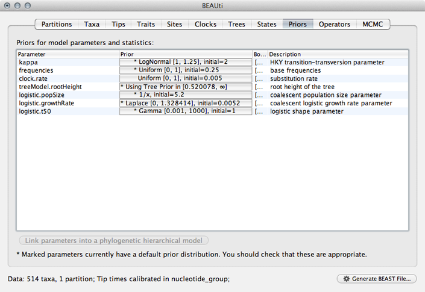
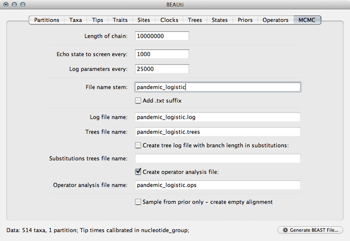

## Prepare a logistic growth analysis

We saw that the skyline analysis suggested that virus population size started off very small near the beginning of 2009 and increased throughout the year, though slowing its rate of increase closer to Sep 2009.
A parametric model of [logistic growth](http://en.wikipedia.org/wiki/Logistic_function#In_ecology:_modeling_population_growth) fits this pattern nicely.
In this model, exponential growth occurs with rate *r*, but is damped as the population size *N* approaches carrying-capacity *K*.
The instantaneous rate of change in population size is:



If we start with some initial population size *N*<sub>0</sub> then we can solve for *N* at an arbitrary time *t*:



However, because TMRCA is constantly varying over the course of the MCMC, BEAST parameterizes logistic growth not in terms of *N*<sub>0</sub>, but instead in terms of *t*<sub>50</sub>, that is the time back from the "present" (in this case 2009.75) when the population is at half its carrying capacity:



Thus, to model logistic growth, we need to estimate *r*, *K* and *t*<sub>50</sub>.

To prepare this XML, start as before, by importing sequence data in the 'Partitions' panel and adding tip dates in the 'Tips' panel.

**Select the 'Trees' panel and choose 'Logistic Growth' from the 'Tree Prior' dropdown.**

This will setup a demographic function based on the above outlined logistic growth model.



**Select the 'Priors' panel and choose a Uniform(0,1) prior for 'clock.rate'.**



The use of a Gamma prior for 'logistic.t50' is rather strange and I believe exists as a holdover from a previous parameterization using a shape parameter to define timescale rather than 'logistic.t50'.
We'll fix this by editing the raw XML later.

**Select the 'MCMC' panel, set the length of the chain to `50000000`, set logging of parameters every `25000` steps and set the file name stem to `pandemic_logistic`.**

This will log parameters and trees to `pandemic_logistic.log` and `pandemic_logistic.trees`.



**Save the XML file as `pandemic_logistic.xml`.**

**Open the resulting file in a text editor and delete the 'trait' block from the the 'logTree' block as before.**

We will also manually set the prior on 'logistic.t50' by replacing the 'gammaPrior' with:

```xml
<uniformPrior lower="0.0" upper="1.0">
	<parameter idref="logistic.t50"/>
</uniformPrior>	
```

With this completed, we are ready to run this analysis in BEAST.

### Next section

* [Run the logistic growth analysis](run-the-logistic-growth-analysis.md)