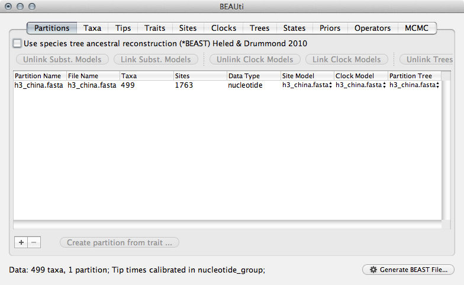
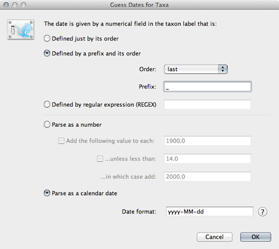
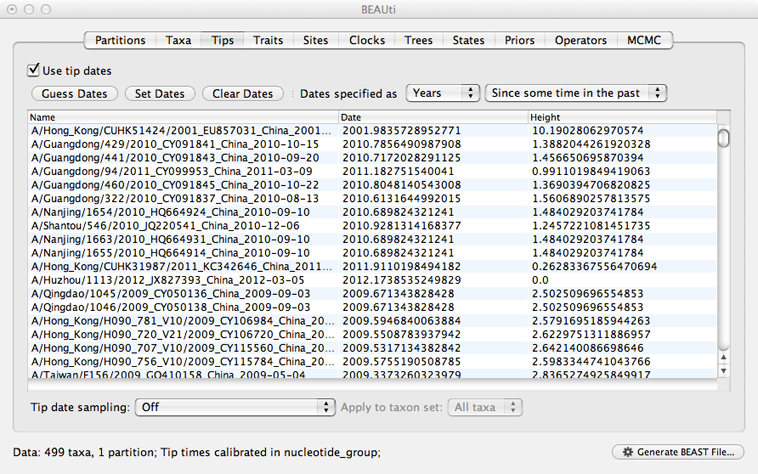
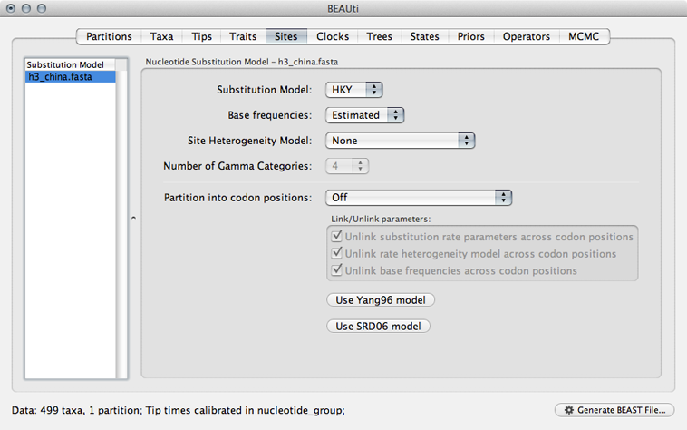
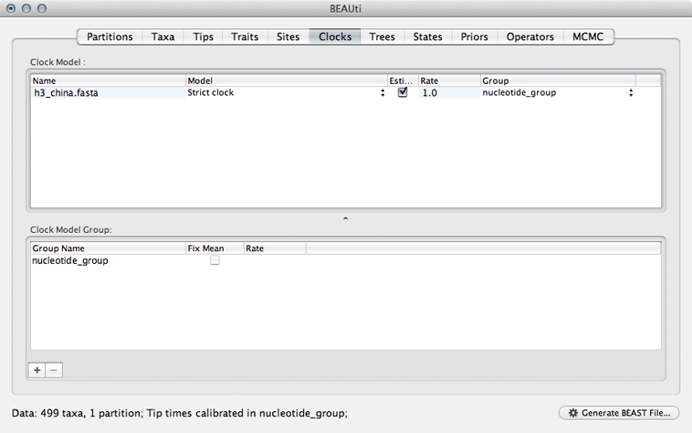
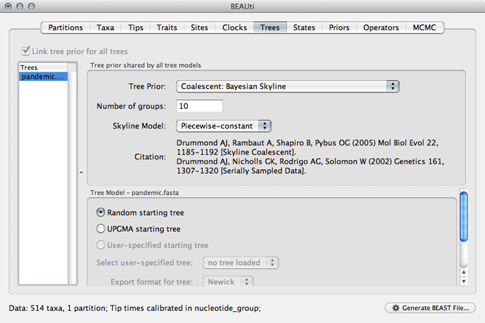
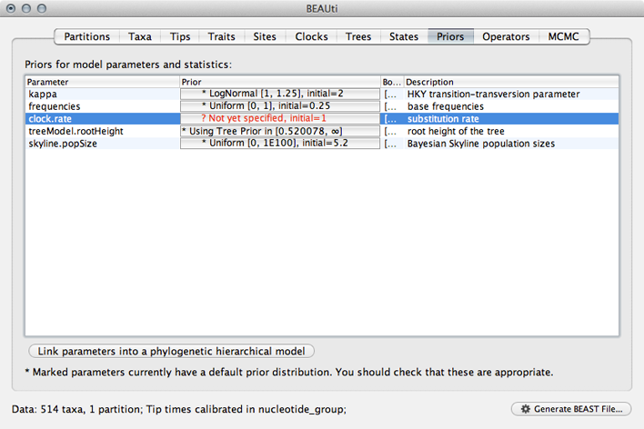
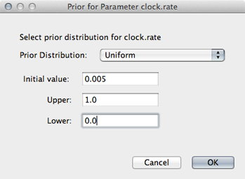
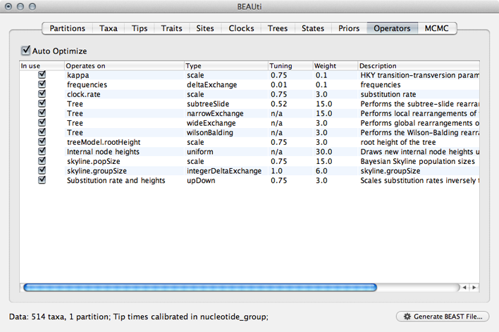

## Prepare a skyline analysis

The program BEAST takes an XML control file that specifies sequence data, metadata and also details the analysis to be run.
All program parameters lie in this control file.
However, to make things easier, BEAST is distributed with the companion program BEAUti that assists in generating the XML.
Here, we will produce an XML that specifies a "skyline" analysis, in which we estimate changes virus population size through time.

**Open BEAUti.**

This will show a window with the 'Partitions' panel open.
We first need to load the sequence data.

**Click on the '+' or choose 'Import Data...' from the File menu and select `pandemic.fasta`.**

This will load a data partition of 514 taxa and 1664 nucleotide sites.



Double-clicking the partition will open a window showing the sequence alignment.
It's good to check to make sure the alignment is in order.

We next label each taxon with its sampling date.

**Select the 'Tips' panel, select 'Use tip dates' and click on 'Guess Dates'.**

We need to tell BEAUti where to find the tip dates in the taxon names.
Here, each taxon name ends with its date of sampling separated by an underscore.

**Select 'Defined by a prefix and its order'.**

**Select 'Order' equals 'last' and input `_` for 'Prefix'.**

**Select 'Parse as calendar date'.**



This will result in the 'Date' and 'Height' columns filing the the date forward from the past and the height of each taxon relative to the most recent taxon.



**Click on 'Date' to sort rows.**

It will be helpful for later to record that the most recent tip has a date of `2009.75`.

Next, we need to specify a model of the process by which nucleotide sites evolve.

**Select the 'Sites' panel.**

We default to a very simple model of evolution.
This shows that we are using an 'HKY' model to parameterize evolution between nucleotides.
This model includes a single 'kappa' parameter that specifies the rate multiplier on transitions (e.g. 'A' to 'G') vs transversions (e.g. 'A' to 'T').
We are estimating base frequencies and specifying no heterogeneity across nucleotide sites in the alignment.
Generally speaking, if internal branches on the tree are long then a more complex evolutionary model will be needed to capture the real branch lengths, while if internal branches are short, then inferences will be fairly robust to model choice.



Next, we need to specify a molecular clock to convert between sequence substitutions and time.

**Select the 'Clocks' panel.**

We default to a strict molecular clock in which substitutions occur at the same rate across branches in the phylogeny.



Next, we need to specify a model that describes phylogenetic structure based on some underlying demographic process.

**Select the 'Trees' panel.**

Here, we will choose a model that describes how the virus population size changes through time.
There are parametric models that assume some basic function (like exponential growth) and there are non-parametric models that don't make any strong assumptions about the pattern of change.
We begin by choosing a non-parametric model.

**Select 'Coalescent: Bayesian Skyline' from the 'Tree Prior' dropdown.**

This model assumes a fixed number of windows, where within each window effective population size is constant and there is some weak autocorrelation between windows to smooth the estimates.
We begin with the default 10 windows ('Number of groups'), and start with a random initial tree.



Generally, these non-parametric skyline (and skyride) models offer flexibility for the data to say what it wants to say.
However, these are relatively complex models and so suffer from the [bias-variance tradeoff](http://scott.fortmann-roe.com/docs/BiasVariance.html).
This often results in wide bounds of uncertainty to the resulting estimates.
We will return to this issue later on.

Next, we need to specify priors for each parameter in the model.

**Select the 'Priors' panel.**

For the most part, BEAST has very sensible default priors.
In this case, we can leave most of the priors at their default values.



However, we are forced to choose a prior for evolutionary rate.

**Click on the prior for 'clock.rate' (currently highlighted in red).**

Although including improper priors will not harm parameter estimates, it will adversely impact the ability to do model comparison, and so it is not recommended.
Here, we still keep an uninformative prior on 'clock.rate', choosing uniform between 0 and 1.

**Select 'Uniform' from the 'Prior Distribution' dropdown.**

**Enter `0.0` as a lower-bound and `1.0` as an upper bound.**

We actually have a good expectation from knowledge of influenza mutation rates that 'clock.rate' should be near 0.005.
We include this as an initial value to aid convergence.

**Enter `0.005` as an 'Initial value'.**



After setting this, the 'clock.rate' prior no longer shows as red.

Next, we need to specify operators (or proposals) for the [MCMC](http://en.wikipedia.org/wiki/Markov_chain_Monte_Carlo) sampler.

**Select the 'Operators' panel.**

The exact choice of MCMC proposals will have no effect on eventual outcomes.
However, good proposals will make the MCMC more efficient and poor proposals will lead to MCMC inefficiency and longer run times.
In this case, we can stick with the default list of operators.



Next, we need to specify how often and where MCMC samples are logged to.

**Select the 'MCMC' panel.**

Generally, larger datasets will require longer chains and less frequent sampling.
I usually aim for 2000 samples, planning to throw out the first 500 or 1000 as [burn-in](http://en.wikipedia.org/wiki/Burn-in).

**Enter `50000000` (50 million) for 'Length of chain'.**

**Enter `25000` for 'Log parameters'.**

**Enter `pandemic_skyline` for 'File name stem'.**

This will result in 2000 samples logged to the files `pandemic_skyline.log` and `pandemic_skyline.trees`.

And that's it.  We just need to save the XML control file.

**Click on 'Generate BEAST File...'**

**Select Continue when shown the priors.**

**Save the XML as `pandemic_skyline.xml`.**

For the most part, BEAUti does a good job creating an XML optimized for the analysis at hand.
However, there are often small details that need to be cleaned up by hand.
In this case, BEAUti defaults to writing out evolutionary rates to every branch in the phylogeny.
However, with a strict clock model, every branch will have the same rate at a particular MCMC step and this rate will already by written to the log file.
Writing out these rates to the trees file will just result in an unnecessarily larger file.

**Open `pandemic_skyline.xml` in a text editor.**

XML is structured in a hierarchical fashion with logical blocks of markup surrounding by open (`<block>`) and close (`</block>`) tags.

**Find the XML block that specifies tree output called 'logTree'.**

```xml
<logTree id="treeFileLog" logEvery="25000" nexusFormat="true" fileName="pandemic_skyline.trees" sortTranslationTable="true">
	<treeModel idref="treeModel"/>
	<trait name="rate" tag="rate">
		<strictClockBranchRates idref="branchRates"/>
	</trait>
	<posterior idref="posterior"/>
</logTree>
```

**Delete the 'trait' block that contains 'strictClockBranchRates'.**

```xml
<logTree id="treeFileLog" logEvery="25000" nexusFormat="true" fileName="pandemic_skyline.trees" sortTranslationTable="true">
	<treeModel idref="treeModel"/>
	<posterior idref="posterior"/>
</logTree>
```

This fine-tuning of the XML can be quite helpful and there are quite a few more advanced analyses that require editing the XML rather than relying on BEAUti output.

I've included this XML with the practical as `xml/pandemic_skyline.xml`.

### Next section

* [Run the skyline analysis](run-the-skyline-analysis.md)