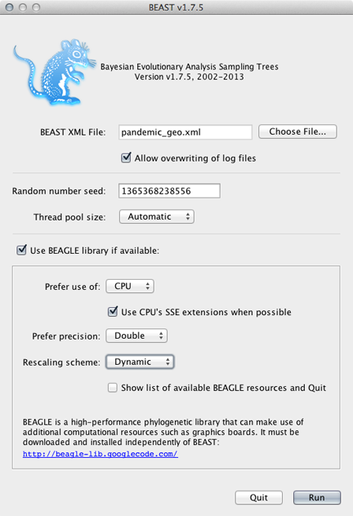

## Run the phylogeographic analysis

**Open BEAST and select the file `pandemic_geo.xml`.**

This analysis (because of the function to infer ancestral states) requires that BEAGLE be loaded.

**Select 'Use BEAGLE library if available'.**

Generally, I turn on SSE as this should give a decent speed increase and set the 'Rescaling scheme' to 'Dynamic'.

**Click on 'Run'.**

This will produce the output files `pandemic_geo.log`, `pandemic_geo.rates`, `pandemic_geo.root` and `pandemic_geo.trees`.
This analysis took ~24 hours to complete on a single cluster node.

I've included these files with the practical in the `output/` directory.

### Next section

* [Examine the phylogeographic output](examine-the-phylogeographic-output.md)